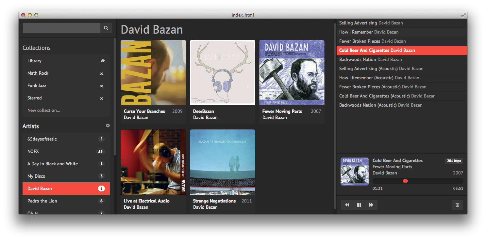

# Headbang.app

## Features

* [x] Ultra fast, even with large libraries (>100gB)
* [x] Separate client and server components. Run the server at home, stream from everywhere
* [x] Standalone web client packaged as a desktop app (using node-webkit)
* [ ] Keyboard Shortcuts
* [ ] Library management
* [ ] Discover
* [ ] Radio Mode
* [ ] Automatic metadata downloading
  * [ ] Last.fm
    * [ ] Artists
    * [x] Albums
  * [ ] Discogs
    * [ ] Genres
    * [ ] Labels
  * [ ] fanart.tv
    * [ ] Artists
    * [ ] Albums
    * [ ] Labels

## Running

1. git clone git@github.com:knoopx/headbang.app.git headbang-app
2. cd headbang-app
3. bundle
4. rake dist

## Requirements

* `npm install -g nodewebkit`
* `vendor/ffmpegsumo.so` with [MP3 playback support](https://github.com/rogerwang/node-webkit/wiki/Support-mp3-and-h264-in-video-and-audio-tag)

## Development

1. git clone git@github.com:knoopx/headbang.app.git headbang-app
2. cd headbang-app
3. bundle
4. middleman server
